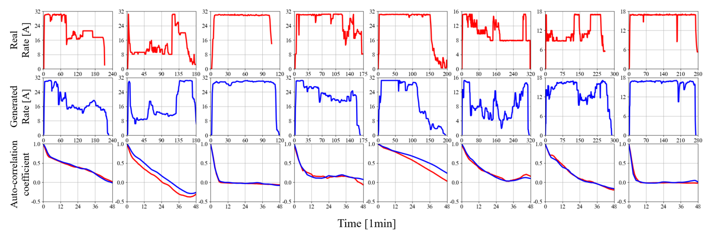

# DiffCharge: Generating EV Charging Scenarios via a Denoising Diffusion Model

Authors: Siyang Li, Hui Xiong, Yize Chen
Hong Kong University of Science and Technology (Guangzhou)

This is the repository for the paper ["DiffCharge: Generating EV Charging Scenarios via a Denoising Diffusion Model"]{https://arxiv.org/abs/2308.09857}.

Recent proliferation of electric vehicle (EV) charging events has brought prominent stress over power grid operation. Due to the stochastic and volatile EV charging behaviors,
the induced charging loads are extremely uncertain, posing
modeling and control challenges for grid operators and charging
management. Generating EV charging scenarios would aid via
synthesizing a myriad of realistic charging scenarios.
we propose a novel denoising Diffusion-based Charging scenario
generation model DiffCharge, which is capable of generating a
broad variety of realistic EV charging profiles with distinctive
temporal properties. 

To generate EV charging curves using trained model, run 

Questions? Contact Siyang at 	sli572@connect.hkust-gz.edu.cn.

